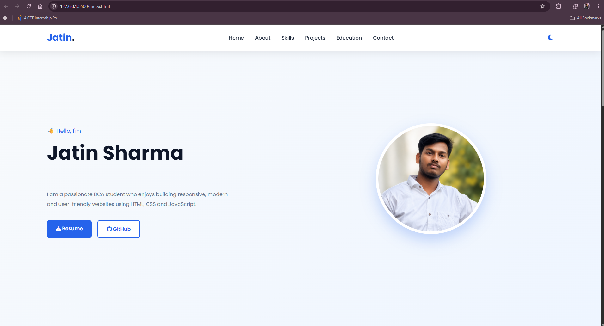

# 💼 Personal Portfolio Website

A modern and responsive personal portfolio website built using **HTML, CSS, and JavaScript**. This project showcases my skills, projects, education, and contact information with a clean Blue & White user interface.

## 🚀 Features

- 🎨 Modern Blue & White Design
- 📱 Fully Responsive Layout
- 🌙 Dark Mode Toggle
- ⌨️ Typing Animation
- 🖼️ Professional Hero Section
- 💡 Smooth Scrolling Navigation
- 📂 Projects Section
- 🎓 Education Section
- 📞 Contact Form
- ✨ Hover Animations

## 🛠️ Technologies Used

- HTML5
- CSS3
- JavaScript (ES6)

## 📁 Project Structure

```
Portfolio/
│── index.html
│── style.css
│── script.js
│── profile.png
│── README.md
```

## 📷 Screenshot

> 

## 📌 Future Improvements

- Add Project Images
- Add Certificates Section
- Connect Contact Form to Email
- Add More Projects
- Improve Animations

## 👨‍💻 Author

**Jatin Sharma**

BCA Student | Frontend Developer

## ⭐ Support

If you like this project, don't forget to **star ⭐ the repository**.

---
